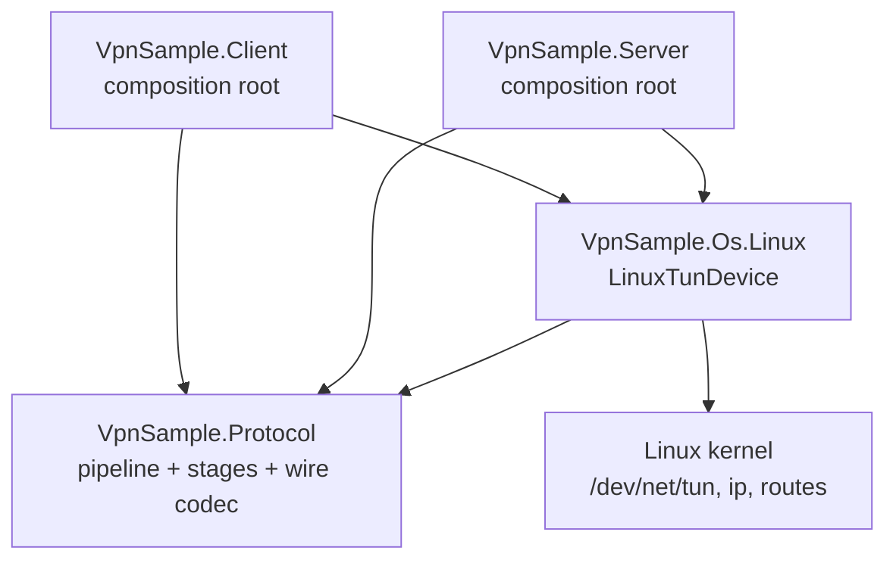
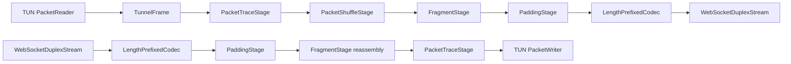
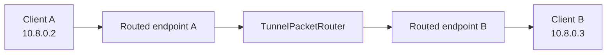
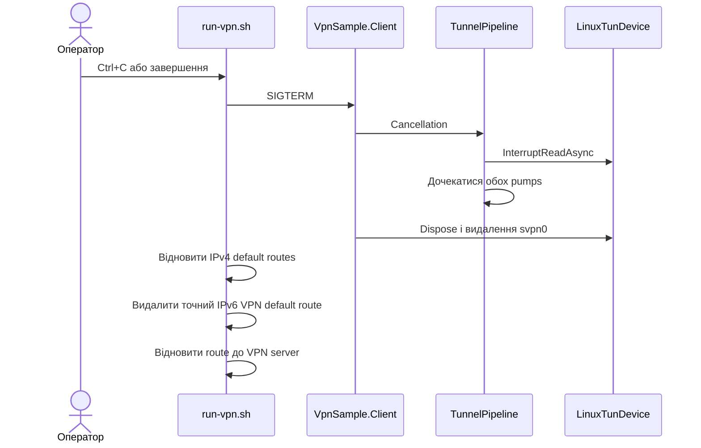

# Архітектура VPNSample

Цей документ описує поточну реалізацію VPN: автоматизацію DigitalOcean, межі між ОС і протоколом, запуск клієнта та шлях IPv4/IPv6-пакетів.

## Загальна схема

```mermaid
flowchart LR
    subgraph Laptop[Клієнтський Linux]
        App[Firefox та інші програми]
        Route[Linux routing]
        CTun[svpn0<br/>10.8.0.X/24 / fd42:8::X/64]
        CLinux[LinuxTunDevice]
        CProtocol[TunnelPipeline<br/>websocket-cover profile]
        CTcp[ClientWebSocket<br/>WSS]

        App <--> Route
        Route <--> CTun
        CTun <--> CLinux
        CLinux <-->|IPacketEndpoint| CProtocol
        CProtocol <-->|кадри тунелю| CTcp
    end

    CTcp <-->|TLS over TCP/443| STcp

    subgraph Droplet[DigitalOcean Ubuntu droplet]
        STcp[Kestrel WebSocket<br/>WSS + cover page]
        SProtocol[TunnelPipeline per connection<br/>websocket-cover profile]
        Router[TunnelPacketRouter<br/>overlay IP → connection]
        SLinux[LinuxTunDevice]
        STun[one svpn0<br/>10.8.0.1/24 / fd42:8::1/64]
        Forward[Linux IP forwarding]
        Nat[NAT44 / NAT66]

        STcp <-->|кадри тунелю| SProtocol
        SProtocol <-->|RoutedPacketEndpoint| Router
        Router <-->|exit-node packets| SLinux
        SLinux <--> STun
        STun <--> Forward
        Forward <--> Nat
    end

    Nat <--> Internet[Інтернет IPv4 та IPv6]
```



Кожен клієнт має окреме TCP-з'єднання, але сервер має лише один TUN `svpn0`.
Сервер передає номер `N` одним байтом перед першим кадром, а клієнт отримує host
`N + 2` у спільних мережах `10.8.0.0/24` і `fd42:8::/64`. `TunnelPacketRouter`
пересилає overlay-пакети безпосередньо у connection адресата, а internet traffic
передає у серверний TUN для Linux forwarding і NAT. Wire traffic і bearer token
шифруються TLS; сервер автентифікується сертифікатом, а token відсікає випадкові
та active-probe запити, хоча ще не є повноцінною client identity.
Тимчасова автоматизація підключається до IP droplet напряму, передає
`vpn.twocubes.io` як WebSocket URI та SNI/Host і перевіряє exact certificate pin.
Kestrel віддає звичайну HTML-сторінку на `/`, а прихований endpoint без коректного
token повертає `404`. Для постійного
deployment DNS `vpn.twocubes.io` має вказувати на сервер, а сертифікат має бути
виданий довіреним CA.

## Розділення рівнів



Відповідальність розділена так:

| Рівень | Відповідальність | Не знає про |
|---|---|---|
| `VpnSample.Protocol` | Межа `IPacketEndpoint`, pipeline стадій, wire codec, handshake, packet router і таблиця overlay IP → connection | `/dev/net/tun`, системні маршрути, DigitalOcean |
| `VpnSample.Os.Linux` | Створення TUN, адреси інтерфейсу, незалежні потоки читання/запису | TCP, сервер, формат розгортання |
| `VpnSample.Client` | WSS-підключення, композиція протоколу з Linux endpoint | Налаштування cloud-сервера |
| `VpnSample.Server` | HTTPS cover site, WSS endpoint, один exit-node TUN і композиція router/pipeline | Клієнтські default routes |
| `scripts/` | Життєвий цикл droplet, deployment, системні маршрути та перевірки | Внутрішній фреймінг пакетів |

Таким чином, OS-level VPN відділений від protocol-level VPN на межі `IPacketEndpoint`. Протокол працює зі `Stream` і не викликає Linux API напряму.

## Pipeline протоколу

`TunnelPipeline` перетворює кожен пакет `IPacketEndpoint` на `TunnelFrame`. На
клієнті endpoint — TUN, а на сервері для кожного connection це channel-backed
`RoutedPacketEndpoint`. Outbound-стадії
виконуються в порядку реєстрації, а inbound-стадії — у зворотному порядку. Це
дозволяє кодувати кадр на клієнті й симетрично декодувати його на сервері.
`baseline` містить tracing і pass-through. `shuffle-split` додає
перестановку вікон до трьох IP-пакетів із flush через 5 ms, а потім ділить
кожен пакет на tunnel fragments розміром до 256 байтів. Стандартний
`websocket-cover` використовує фрагменти до 240 байтів і `PaddingStage`, який
доповнює їх випадковими байтами до одного з фіксованих size buckets.



Перед обміном кадрами обидві сторони надсилають handshake з magic `SVPN`,
версією протоколу та назвою профілю. Різні версії або профілі завершують сесію
явною помилкою замість пошкодження потоку.

## Формат даних у тунелі

`LengthPrefixedCodec` записує один `TunnelFrame` у такому форматі:

```text
+---------------+--------------+----------------+----------------+------------------+
| uint32 BE     | uint64 BE    | uint16 BE      | uint16 BE      | payload          |
| body length   | packet ID    | fragment index | fragment count | 1..65535 bytes   |
+---------------+--------------+----------------+----------------+------------------+
```

У `baseline` кожен пакет має `fragmentIndex = 0` і `fragmentCount = 1`. У
`shuffle-split` і `websocket-cover` створюють кілька кадрів зі спільним
`packet ID`; на приймальній стороні `FragmentStage` перевіряє індекси та
загальний розмір перед reassembly. У `websocket-cover` поле payload додатково
містить original-length prefix і випадковий padding до bucket size.

## Послідовність розгортання і запуску

```mermaid
sequenceDiagram
    actor User as Оператор
    participant Create as create-droplet.sh
    participant DO as DigitalOcean API
    participant Deploy as deploy-server.sh
    participant Host as Droplet/systemd
    participant Run as run-vpn.sh
    participant Client as VpnSample.Client

    User->>Create: Запустити створення
    Create->>Create: Створити passwordless Ed25519 key
    Create->>DO: Зареєструвати key і створити IPv6-enabled droplet
    DO-->>Create: Droplet ID та публічні адреси
    Create->>Create: Записати .vpn-droplet.env

    User->>Deploy: Розгорнути сервер
    Deploy->>Host: Publish, copy, install .NET та service
    Deploy->>Host: Увімкнути IPv4/IPv6 forwarding
    Deploy->>Host: Додати NAT44 і NAT66
    Deploy->>Deploy: Згенерувати bearer token
    Deploy->>Host: Перевірити cover page і probe → 404

    User->>Run: Запустити локальний VPN
    Run->>Run: Зберегти наявні routes
    Run->>Run: Додати прямий route до VPN server
    Run->>Client: Запустити з sudo
    Client->>Host: TCP connect
    Client->>Host: TLS 1.2/1.3, SNI vpn.twocubes.io, ALPN http/1.1
    Client->>Host: GET /api/v1/events + WebSocket Upgrade + bearer token
    Host-->>Client: 101 Switching Protocols
    Host->>Host: Створити один exit-node svpn0 під час старту
    Host-->>Client: Номер клієнта N
    Host->>Host: Зареєструвати IP клієнта у TunnelPacketRouter
    Client->>Client: Створити svpn0 з host N+2 у спільному subnet
    Client->>Host: Handshake version + websocket-cover profile
    Host-->>Client: Handshake version + websocket-cover profile
    Client->>Host: Запустити tunnel pumps
    Run->>Run: Перевірити IPv4 та IPv6 peers
    Run->>Run: Перемкнути IPv4 default route
    Run->>Run: Додати IPv6 default route metric 50
    Run->>Run: Перевірити route selection для IPv4 та IPv6
```

Прямий маршрут до публічної IPv4-адреси droplet залишається через звичайний gateway. Це не дає TCP-транспорту спробувати пройти через власний тунель.

## Шлях пакета

Для вихідного трафіку Firefox послідовність однакова для IPv4 й IPv6:

```mermaid
flowchart LR
    Browser[Firefox] --> CRoute[Маршрути клієнта]
    CRoute --> ClientTun[svpn0]
    ClientTun --> Shuffle[Shuffle packet window]
    Shuffle --> Frame[Split and pad TunnelFrames]
    Frame --> HTTPS[TLS + WebSocket<br/>TCP 443]
    HTTPS --> Unframe[Відновлений IP packet]
    Unframe --> Router[TunnelPacketRouter]
    Router --> ServerTun[shared svpn0]
    ServerTun --> Forward[IP forwarding]
    Forward --> Choice{Версія IP}
    Choice -->|IPv4| NAT44[iptables MASQUERADE]
    Choice -->|IPv6| NAT66[ip6tables MASQUERADE]
    NAT44 --> Web[Цільовий сайт]
    NAT66 --> Web
```



Відповідь проходить той самий шлях у зворотному напрямку. Тому сайт має бачити публічні IPv4 та IPv6 droplet, а не адреси локального провайдера.

Для client-to-client пакета router знаходить connection за destination IP і
пересилає пакет безпосередньо, не віддаючи його Linux TUN:



## Адреси та маршрути

| Призначення | Клієнт | Сервер |
|---|---|---|
| Tunnel IPv4 | `10.8.0.X/24`, connected route `10.8.0.0/24` | `10.8.0.1/24` на одному `svpn0` |
| Tunnel IPv6 | `fd42:8::X/64`, connected route `fd42:8::/64` | `fd42:8::1/64` на одному `svpn0` |
| Default IPv4 | Перемикається на `svpn0` | Forward + NAT44 у зовнішню мережу |
| Default IPv6 | Додається через `svpn0` з metric `50` | Forward + NAT66 у зовнішню мережу |
| VPN transport | Прямий route до public IPv4 droplet, WSS із SNI `vpn.twocubes.io` | Kestrel HTTPS/WSS на `0.0.0.0:443` |

Metric IPv6-маршруту можна змінити через `VPN_ROUTE_METRIC`. Скрипт перевіряє фактичний результат `ip route get` для обох сімейств адрес і завершується з помилкою, якщо маршрут оминає `svpn0`.

## Зупинка та відновлення мережі



Окремо `create-droplet.sh --delete` видаляє droplet, зареєстрований у DigitalOcean SSH key, локальну тимчасову пару ключів і state-файл.

## Поточні обмеження

- Сервер має 253 адреси клієнтів і повторно використовує адресу після відключення.
- TLS автентифікує сервер, bearer token обмежує доступ до WSS, але клієнти поки
  не мають окремих identities або ротації credentials.
- Транспорт працює поверх TCP, тому можливий ефект TCP-over-TCP під час втрат пакетів.
- `websocket-cover` змінює внутрішній потік і відповідає як звичайний сайт на
  probes, але не приховує destination IP, TLS
  fingerprint, загальний обсяг або timing і не гарантує обхід DPI.
- Packet reordering може бути помітний протоколам поверх UDP; TCP відновлює
  порядок власним sequence space.
- IPv6 назовні використовує NAT66, а не делегований клієнту глобальний IPv6 prefix.
- Це навчальна реалізація, а не production VPN із керуванням користувачами, ротацією ключів та kill switch.
