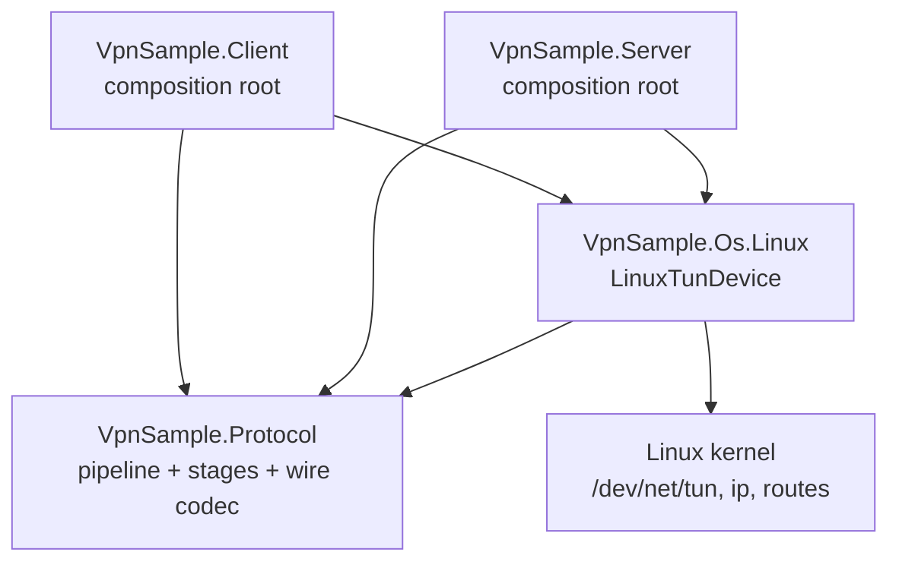
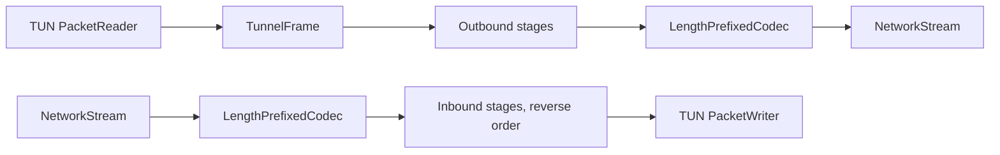
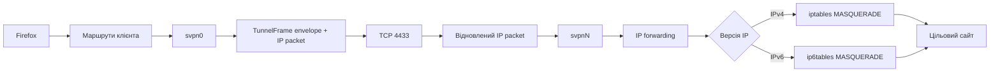
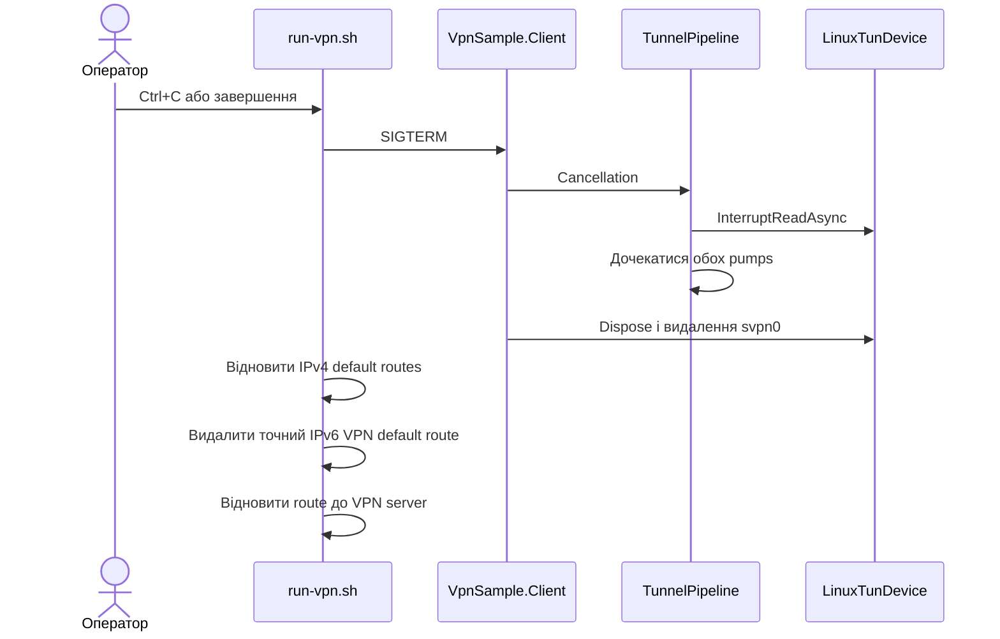

# Архітектура VPNSample

Цей документ описує поточну реалізацію VPN: автоматизацію DigitalOcean, межі між ОС і протоколом, запуск клієнта та шлях IPv4/IPv6-пакетів.

## Загальна схема

```mermaid
flowchart LR
    subgraph Laptop[Клієнтський Linux]
        App[Firefox та інші програми]
        Route[Linux routing]
        CTun[svpn0<br/>10.8.N.2 / fd42:8:N::2]
        CLinux[LinuxTunDevice]
        CProtocol[TunnelPipeline<br/>baseline profile]
        CTcp[NetworkStream]

        App <--> Route
        Route <--> CTun
        CTun <--> CLinux
        CLinux <-->|IPacketEndpoint| CProtocol
        CProtocol <-->|кадри тунелю| CTcp
    end

    CTcp <-->|TCP/4433| STcp

    subgraph Droplet[DigitalOcean Ubuntu droplet]
        STcp[NetworkStream]
        SProtocol[TunnelPipeline<br/>baseline profile]
        SLinux[LinuxTunDevice]
        STun[svpnN<br/>10.8.N.1 / fd42:8:N::1]
        Forward[Linux IP forwarding]
        Nat[NAT44 / NAT66]

        STcp <-->|кадри тунелю| SProtocol
        SProtocol <-->|IPacketEndpoint| SLinux
        SLinux <--> STun
        STun <--> Forward
        Forward <--> Nat
    end

    Nat <--> Internet[Інтернет IPv4 та IPv6]
```



Кожен клієнт має окреме TCP-з'єднання і окремий серверний TUN `svpnN`. Сервер
передає номер `N` одним байтом перед першим кадром. З цього номера обидві сторони
утворюють IPv4 та IPv6 адреси. TCP не шифрується і не автентифікується.

## Розділення рівнів



Відповідальність розділена так:

| Рівень | Відповідальність | Не знає про |
|---|---|---|
| `VpnSample.Protocol` | Межа `IPacketEndpoint`, pipeline стадій, wire codec, handshake і двонапрямне копіювання | `/dev/net/tun`, маршрути, DigitalOcean |
| `VpnSample.Os.Linux` | Створення TUN, адреси інтерфейсу, незалежні потоки читання/запису | TCP, сервер, формат розгортання |
| `VpnSample.Client` | TCP-підключення, композиція протоколу з Linux endpoint | Налаштування cloud-сервера |
| `VpnSample.Server` | TCP listener, приймання клієнта, композиція компонентів | Клієнтські default routes |
| `scripts/` | Життєвий цикл droplet, deployment, системні маршрути та перевірки | Внутрішній фреймінг пакетів |

Таким чином, OS-level VPN відділений від protocol-level VPN на межі `IPacketEndpoint`. Протокол працює зі `Stream` і не викликає Linux API напряму.

## Pipeline протоколу

`TunnelPipeline` перетворює кожен пакет TUN на `TunnelFrame`. Outbound-стадії
виконуються в порядку реєстрації, а inbound-стадії — у зворотному порядку. Це
дозволяє майбутній стадії кодувати кадр на клієнті й симетрично декодувати його
на сервері. Поточний `baseline`-профіль містить лише tracing і pass-through.



Перед обміном кадрами обидві сторони надсилають handshake з magic `SVPN`,
версією протоколу та назвою профілю. Різні версії або профілі завершують сесію
явною помилкою замість пошкодження потоку.

## Формат даних у тунелі

`LengthPrefixedCodec` записує один `TunnelFrame` у такому форматі:

```text
+---------------+--------------+----------------+----------------+------------------+
| uint32 BE     | uint64 BE    | uint16 BE      | uint16 BE      | payload          |
| body length   | packet ID    | fragment index | fragment count | 1..65535 bytes   |
+---------------+--------------+----------------+----------------+------------------+
```

У baseline кожен пакет має `fragmentIndex = 0` і `fragmentCount = 1`. Поля
фрагментації вже є в envelope, але жодна fragmentation-стадія ще не реалізована.

## Послідовність розгортання і запуску

```mermaid
sequenceDiagram
    actor User as Оператор
    participant Create as create-droplet.sh
    participant DO as DigitalOcean API
    participant Deploy as deploy-server.sh
    participant Host as Droplet/systemd
    participant Run as run-vpn.sh
    participant Client as VpnSample.Client

    User->>Create: Запустити створення
    Create->>Create: Створити passwordless Ed25519 key
    Create->>DO: Зареєструвати key і створити IPv6-enabled droplet
    DO-->>Create: Droplet ID та публічні адреси
    Create->>Create: Записати .vpn-droplet.env

    User->>Deploy: Розгорнути сервер
    Deploy->>Host: Publish, copy, install .NET та service
    Deploy->>Host: Увімкнути IPv4/IPv6 forwarding
    Deploy->>Host: Додати NAT44 і NAT66

    User->>Run: Запустити локальний VPN
    Run->>Run: Зберегти наявні routes
    Run->>Run: Додати прямий route до VPN server
    Run->>Client: Запустити з sudo
    Client->>Host: TCP connect
    Host-->>Client: Номер клієнта N
    Host->>Host: Створити svpnN
    Client->>Client: Створити svpn0 з адресами для N
    Client->>Host: Handshake version + baseline profile
    Host-->>Client: Handshake version + baseline profile
    Client->>Host: Запустити tunnel pumps
    Run->>Run: Перевірити IPv4 та IPv6 peers
    Run->>Run: Перемкнути IPv4 default route
    Run->>Run: Додати IPv6 default route metric 50
    Run->>Run: Перевірити route selection для IPv4 та IPv6
```

Прямий маршрут до публічної IPv4-адреси droplet залишається через звичайний gateway. Це не дає TCP-транспорту спробувати пройти через власний тунель.

## Шлях пакета

Для вихідного трафіку Firefox послідовність однакова для IPv4 й IPv6:



Відповідь проходить той самий шлях у зворотному напрямку. Тому сайт має бачити публічні IPv4 та IPv6 droplet, а не адреси локального провайдера.

## Адреси та маршрути

| Призначення | Клієнт | Сервер |
|---|---|---|
| Tunnel IPv4 | `10.8.N.2/32`, peer `10.8.N.1` | `10.8.N.1/32`, peer `10.8.N.2` |
| Tunnel IPv6 | `fd42:8:N::2/64` | `fd42:8:N::1/64` |
| Default IPv4 | Перемикається на `svpn0` | Forward + NAT44 у зовнішню мережу |
| Default IPv6 | Додається через `svpn0` з metric `50` | Forward + NAT66 у зовнішню мережу |
| VPN transport | Прямий route до public IPv4 droplet | TCP listener на `0.0.0.0:4433` |

Metric IPv6-маршруту можна змінити через `VPN_ROUTE_METRIC`. Скрипт перевіряє фактичний результат `ip route get` для обох сімейств адрес і завершується з помилкою, якщо маршрут оминає `svpn0`.

## Зупинка та відновлення мережі



Окремо `create-droplet.sh --delete` видаляє droplet, зареєстрований у DigitalOcean SSH key, локальну тимчасову пару ключів і state-файл.

## Поточні обмеження

- Сервер має 256 номерів клієнтів і повторно використовує номер після відключення.
- TCP-трафік тунелю не шифрується і не автентифікується.
- Транспорт працює поверх TCP, тому можливий ефект TCP-over-TCP під час втрат пакетів.
- IPv6 назовні використовує NAT66, а не делегований клієнту глобальний IPv6 prefix.
- Це навчальна реалізація, а не production VPN із керуванням користувачами, ротацією ключів та kill switch.
